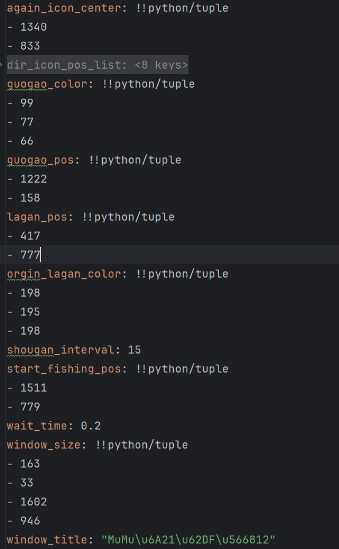

# 三国杀阿超钓鱼脚本

## **项目简介**: 

本项目是一个用于三国杀阿超钓鱼的自动化脚本，通过模拟点击操作，实现自动钓鱼，提高钓鱼效率和伤害。

## **使用步骤**

1.**克隆代码**: 将代码克隆到本地电脑。

```bash
git clone https://github.com/KeNanXiaoLin/sgsminigame
```

2.**安装环境**: 下载 Python 3.9(最好和我的版本一致，否则有些库可能不兼容)，并使用 PyCharm 打开项目，安装 `requirements.txt` 中的库。

```bash
pip3 install -r requirements.txt
```

3.**生成配置文件**: 运行 `main.py` 文件，在项目同级目录下会生成 `config.yaml` 配置文件。

只有两个默认参数，模拟器大小和模拟器名称，模拟器窗口大小不用管，窗口标题需要自己修改，改成你使用的模拟器名称，比如我使用的模拟器是MuMu模拟器12,

名称就是MuMu模拟器12，如果是雷电模拟器，就改名就行了。名称一定要写对，不然找不到你的模拟器窗口。

4.**运行脚本**: 在模拟器中打开三国杀阿超钓鱼界面，运行 `main.py` 文件即可开始自动钓鱼。


就是这个界面，然后就可以再次运行main.py就可以了。

**配置文件中的参数说明**:




**again_icon_center**:再来一次按钮的中心点坐标。

**guogao_color**:用来判断压力是否过高的点的颜色。

**guogao_pos**:用来判断压力是否过高的点的位置。

**lagan_pos**:钓鱼界面拉杆位置中心点坐标。

**origin_lagan_color**:钓鱼界面拉杆位置中心点颜色。

**shougan_interval**:收杆的间隔。

**start_fishing_pos**:开始钓鱼按钮的中心点坐标。

**wait_time**:在压力水平过高时候的等待时间。

**window_size**:模拟器窗口大小。

**window_title**:模拟器窗口标题。

**建议修改的参数**:

- **shougan_interval**: 收杆时间，影响爆发的频率。
- **wait_time**: 等待时间，调小可以让伤害稳定在高水平线。

## 更新日志

**修复了在巨野泽钓鱼无法正确识别钓鱼的bug**
